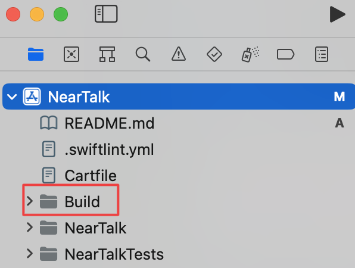
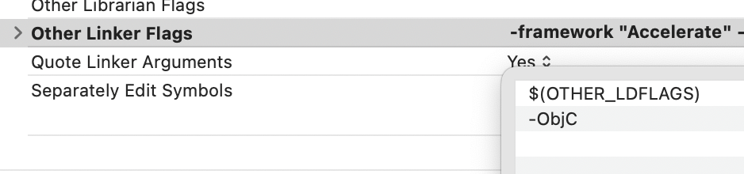

# NearTalk 소개

<p align="center"></p>

<p align="center">
  
  
  
  
</p>

- 근처에 있는 사람들과 실시간 소통할 수 있는 메신저 앱 "근방톡" 입니다.
- 실시간 위치 기반으로 근처에 있는 채팅방에 입장하고 대화할 수 있습니다.
- 친구를 맺고 DM을 보낼 수 있습니다.

## 팀원 소개

|`S001` 고병학|`S009` 김영욱|`S013` 김준영|`S025` 신동은|`S046` 임창묵|
|:--:|:--:|:--:|:--:|:--:|
||||||
|[@bengHak](https://github.com/bengHak)|[@yw22](https://github.com/yw22)|[@prestonk162](https://github.com/prestonk162)|[@dongeunshin](https://github.com/dongeunshin)|[@lymchgmk](https://github.com/lymchgmk)|

## 개발환경 및 라이브러리

### iOS 최소 버전
- iOS `15.0`

### 개발환경
- Xcode `14.1`
- macOS Ventura `13.0`
- macOS Monterey `12.6`

### 프레임워크 및 라이브러리 버전

- RxSwift `6.5.0`
- RxCocoa `6.5.0`
- RxGesture `4.0.0`
- RxBlocking `6.5.0`
- Firebase `10.3.0`
- SnapKit `5.6.0`
- Kingfisher `7.4.1`
- Then `3.0.0`

## 기능

### 사용자 실시간 위치를 기준으로 채팅방 생성

### 애플 소셜 로그인

### 푸시 알림 On/Off

### 프로필 등록 및 수정

#### 프로필 등록
첫 로그인 이후, 프로필 등록 단계에서 프로필 등록이 가능합니다. (로그인 직후, 앱을 종료할 경우, 프로필 등록 페이지로 이동합니다)

#### 프로필 수정
앱 로그인 이후, 마이 프로필 -> 프로필 수정 화면에서 프로필 수정이 가능합니다.

<table>
 <tr>
    <td>프로필 등록</td>
    <td>프로필 수정</td>
 </tr>
 <tr>
    <td></td>
    <td></td>
   </td>
 <tr>
</table>


프로필은 다음의 요소로 구성됩니다.
```
- 닉네임 (한글, 영어소문자, 숫자만 포함된 3-20자 텍스트)
- 상태메세지 (50자 이하 텍스트)
- 이미지 (사진)
```

### 다크 모드 지원
마이 프로필 -> 앱 설정 -> 테마 설정 화면에서 테마 선택이 가능합니다.

테마 모드
```
- 시스템 설정 (설정 앱에서 선택한 테마)
- 다크 모드 (설정 앱 테마 값 무시)
- 라이트 모드 (설정 앱 테마 값 무시)
```

<table>
   <tr>
      <td>시스템 설정 (라이트)</td>
      <td>시스템 설정 (다크)</td>
      <td>다크 모드</td>
      <td>라이트 모드</td>
   </tr>
   <tr>
      <td>
      
      </td>
      <td>
      
      </td>
      <td>
      
      </td>
      <td>
      
      </td>
   </tr>
</table>

### 그룹 채팅

### 친구 추가

### DM 채팅

## 아키텍쳐 & 디자인 패턴

### Clean Architecture

- 프레젠테이션 레이어, 도메인 레이어, 데이터 레이어로 분리된 코드로 각 레이어에서 개발한 결과물을 합칠 때 이점이 있기 때문에 도입했습니다.
- 도메인 레이어가 UI와 독립적이기 때문에 비즈니스 로직의 유닛 테스트에 용이합니다.
- MVVM에서 viewModel이 커지는 것을 use case와 repsoitory 코드로 분산할 수 있습니다.

### MVVM - C

- View와 독립적으로 개발할 수 있는 viewModel을 활용해서 유닛 테스트하기에 용이한 **MVVM 패턴**을 도입했습니다.
- View의 화면전환 로직을 viewController에서 분리하는 것으로 화면전환을 유연하게 할 수 있는 **코디네이터 패턴**을 도입했습니다.

## 기술적인 도전

### Carthage

1. Carthage 설치 (터미널에서 실행)
   - `brew install carthage`
2. 프로젝트 폴더에서 프레임워크, 라이브러리 빌드 (터미널에서 실행)
   - `carthage update --use-xcframeworks --platform iOS`
3. 프로젝트 폴더 내 `Carthage/Build/` 폴더를 Xcode 프로젝트 최상단에 추가

   
4. Target의 "Build Settings"에 "Other Linker Flags"에 `$(OTHER_LDFLAGS) -ObjC`를 추가한다.

   

